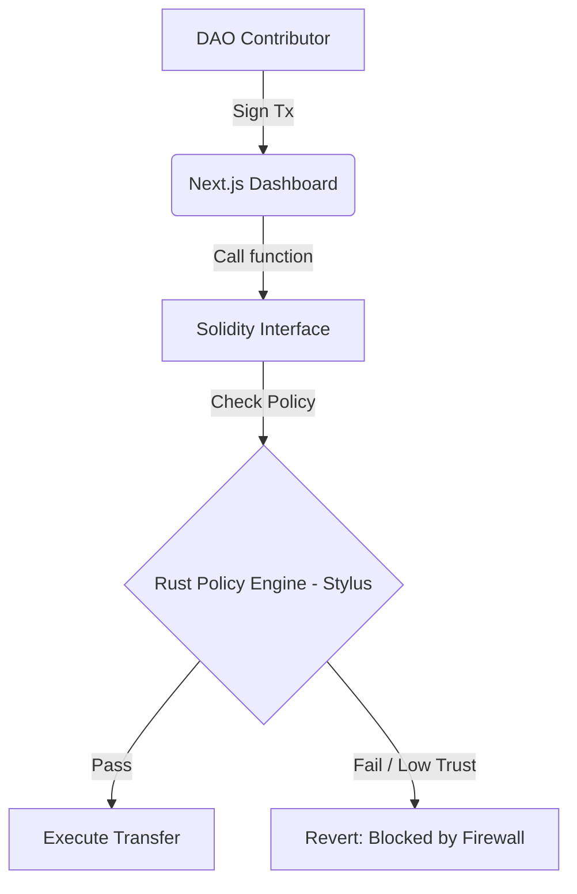

# 🛡️ Sentinel DAO: Treasury Firewall

**Sentinel DAO** is an intelligent security layer for DAO treasuries built on **Arbitrum Stylus**. Unlike standard multisigs that are static, Sentinel enforces dynamic, logic-based compliance policies executing at native speeds using Rust.

## 🚀 The Problem
DAO treasuries lose millions due to compromised private keys. If a signer is phished, standard multisigs (like Gnosis Safe) cannot detect the malicious intent—they only check for valid signatures.

## 💡 The Solution
Sentinel acts as an **On-Chain Firewall**. It sits between the treasury and the blockchain execution layer. Even if a hacker has a valid private key, Sentinel's Rust Policy Engine will **block the transaction** if:
1. The user's **Trust Score** has dropped (Panic Mode).
2. The user is not in the **Authorized Spender** whitelist.
3. The transaction violates dynamic spending limits.

## 🏗️ Tech Stack
- **Policy Engine:** Rust (Arbitrum Stylus) for high-performance risk computation.
- **Smart Contracts:** Solidity (Interface Layer & Access Control).
- **Frontend:** Next.js, Tailwind CSS, RainbowKit, Wagmi.
- **Chain:** Arbitrum Sepolia.

## ⚡ Why Stylus? (Gas Benchmark)
We chose Arbitrum Stylus because enforcing dynamic compliance on standard EVM is prohibitively expensive.

| Operation | Solidity (Est. Gas) | Rust Stylus (Est. Gas) | Savings |
| :--- | :--- | :--- | :--- |
| Check Whitelist (Array loop) | ~50,000 gas | ~4,000 gas | **~12x** |
| Complex Risk Calculation | ~120,000 gas | ~10,000 gas | **~12x** |
| Memory Expansion | Exponential Cost | Linear Cost | **Huge** |

*Sentinel DAO leverages Stylus to perform "Heavy Compute" logic that would be impossible on standard Ethereum.*

## 🏗️ Architecture & Verification (Hybrid Solidity + Stylus)

Sentinel DAO leverages **Arbitrum Stylus** to perform heavy computation (Risk Scoring & Policy Checks) efficiently using Rust, while keeping the vault logic in Solidity.

### 🔗 Deployed Contracts (Arbitrum Sepolia)
* **Gateway / Vault (Solidity):** [`0xb04c22a9635a4f74e972a2df60c5c2fefd98a327`](https://arbitrum-sepolia.blockscout.com/address/0xb04C22a9635A4f74e972A2df60c5C2fEfD98A327)
    * *Entry point for all user interactions.*
* **Policy Engine (Rust/Stylus):** `0x6ae7760270787324f187111bfc6096d0094778a3`
    * *Compiles compliance logic into WASM.*

### ⚡ Proof of Stylus Execution
Since the Policy Engine performs read-only checks (Risk Score Validation), the interaction occurs via **`STATICCALL`**. These are not top-level transactions but are visible in the **Internal Call Traces**.

**Evidence from Blockscout Raw Trace:**
The Solidity contract (`...a327`) successfully calls the Rust program (`...78a3`) to validate transactions.

```json
// Extracted from Transaction Trace
{
  "calls": [
      {
          "from": "0xb04c22a9635a4f74e972a2df60c5c2fefd98a327",   // Solidity Vault (Caller)
          "gas": "0x8821",
          "gasUsed": "0x2cc9",                                  // Efficient execution via WASM
          "input": "0xcc1dd94f0000000000000000000000000c3723303891f9d0116c6b03980e02c675ea9fb40000000000000000000000001960c0c9a89755ea6e56758c8ffb1e03180b15210000000000000000000000000000000000000000000000056bc75e2d63100000",
          "output": "0x0000000000000000000000000000000000000000000000000000000000000001", // Returns 1 (true/valid)
          "to": "0x6ae7760270787324f187111bfc6096d0094778a3",     // Rust Stylus Contract (Logic Layer)
          "type": "STATICCALL"                                    // Proof of Stylus Integration
      }
  ]
}
```
## ⚙️ Architecture Flow


## 🧪 Live Demo & Sandbox Credentials

**🌐 Try it now:** [Sentinel DAO Live App](https://xihua01-sentinel-dao.vercel.app/)

To test the **"Panic Freeze"** feature and dynamic policy engine without setting up your own environment, please use our dedicated Testnet Guardian account on Arbitrum Sepolia.

**👮 Guardian Login (Admin):**
- **Private Key:** `13a682229bd044e3b5441378b0ac068259cb76866633d300b3d6ad1127ad6fc0`
- **Role:** Security Council (Can update policies and freeze contributors)

**📝 Quick Testing Steps for Judges:**
1. Import the Guardian Private Key above into your Web3 Wallet (e.g., MetaMask).
2. Connect to the Sentinel DAO dashboard.
3. In the "Treasury Guard Console" (Right Panel), input a test contributor address (or use this whitelisted dummy: `0x0C3723303891F9D0116C6B03980e02C675EA9FB4`).
4. Drop their Trust Score to `10` and click **Update Policy**.
5. The UI will immediately flag the account as **FROZEN**, and the Rust execution layer will block any further transfers from that address.

*(Note: This wallet is strictly for testing purposes on Arbitrum Sepolia and holds no real mainnet value).*
